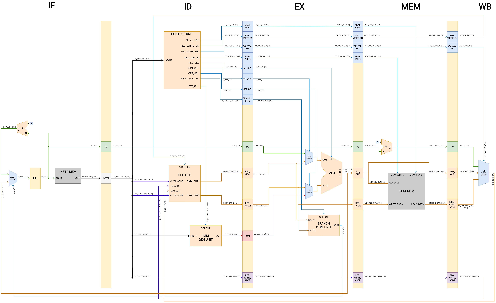

# RV32IM Pipeline Implementation - Group 1

---

<!-- 
This is a sample image, to show how to add images to your page. To learn more options, please refer [this](https://projects.ce.pdn.ac.lk/docs/faq/how-to-add-an-image/)

 -->

## Team
-  E/17/018, Imesh Balasuriya, [email](mailto:e17018@eng.pdn.ac.lk)
-  E/17/091, Adithya Gallage, [email](mailto:e17091@eng.pdn.ac.lk)
-  E/17/296, Ravisha Rupasinghe, [email](mailto:e17296@eng.pdn.ac.lk)
-  E/17/342, Tharmapalan Thanujan, [email](mailto:e17342@eng.pdn.ac.lk)

## Table of Contents
1. [Introduction](#introduction)
2. [Pipeline Datapath](#pipeline-datapath)
3. [Hardware Units](#hardware-units)
4. [Links](#links)

---

## Introduction

This project aims to implement an in-order 5-stage pipelined CPU which implements the RV32I base instruction set and the M instruction set extension for multiplication/division operations as per the RISC-V ISA specification.

## Pipeline Datapath

The CPU design consists of the following stages.

- **Instruction Fetch (IF)** - An instruction is fetched from the instruction memory.

- **Instruction Decode (ID)** - The instruction is decoded to generate the control signals and read the relevant operands from the register file, if necessary.

- **Execute (EX)** - The computations necessary for the instruction are performed by the ALU.

- **Memory Access (MEM)** - Read/write operations on the data memory are performed.

- **Writeback (WB)** - The results of the instruction, if any, are written back to the register file.

The pipeline datapath for the CPU is illustrated in the following diagram along with the labeled data and control signal.

## Hardware Units

Within the design, the following primary hardware units can be identified.

- **Control Unit** - Decodes the opcode, funct3, and funct7 segments of the instruction to generate the relevant control signals necessary for the execution of the instruction.

- **Register File** - A 32x32-bit register file with two read ports and one write port. As per the RV32I specification, the first register x0 is hard-wired to ground.

- **Immediate Generation Unit** - According to the RV32I base ISA, the encoding of the immediate values vary depending on the instruction type. Hence, the immediate generation unit is used to construct the immediate value based on the instruction type using input from the control unit.

- **ALU** - The Arithmetic and Logic Unit (ALU) performs various computations using two 32-bit integer operands to produce a 32-bit result as the output.

- **Branch Control Unit** - The Branch Control Unit generates the control signal to modify the PC value for branch/jump instructions. For conditional branch instructions, the condition is evaluated by comparing the DATA1 and DATA2 values based on the SELECT signal which indicates the branch type.

## Links

- [Project Repository](https://github.com/cepdnaclk/{{ page.repository-name }}){:target="_blank"}
- [Project Page](https://cepdnaclk.github.io/{{ page.repository-name}}){:target="_blank"}
- [Department of Computer Engineering](http://www.ce.pdn.ac.lk/)
- [University of Peradeniya](https://eng.pdn.ac.lk/)

[//]: # (Please refer this to learn more about Markdown syntax)
[//]: # (https://github.com/adam-p/markdown-here/wiki/Markdown-Cheatsheet)
